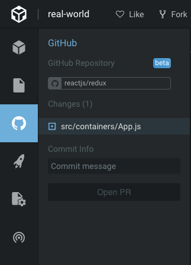

## Base Concept

With CodeSandbox you can import any public GitHub repository as a sandbox, this concept is described in more detail [here](/docs/importing#import-from-github). An imported sandbox will automatically stay in sync with the GitHub repository; if you make a commit to GitHub it will reflect immediately in the sandbox.

For that reason we've made GitHub sandboxes immutable, this means that you cannot make direct changes to the sandbox itself. However, you can still fork the sandbox. When you create a fork of a GitHub sandbox we will still keep a reference to the original GitHub repository. This allows you to create commits and open pull requests from the forked sandboxes.

## Committing and Opening PRs

You can see a forked sandbox of a GitHub sandbox as a separate branch. We still keep a reference to the original branch, and we also track the changes that happen. When you create a fork of the Git sandbox you will see a new panel in the sidebar that looks like this:

This panel will show all the files that have been changed compared to the GitHub sandbox you forked from. When you fork a sandbox from your own repository you will be able to create a commit or open a pull request, if you don't own the repo you can only open a pull request.

## Creating a Repository

If you have a sandbox that you want to have on GitHub you can simply do that by pressing the GitHub icon in the sidebar, entering your repository name and clicking 'Create Repository'. We will automatically open the sandbox that's synced to the GitHub repository for you.
